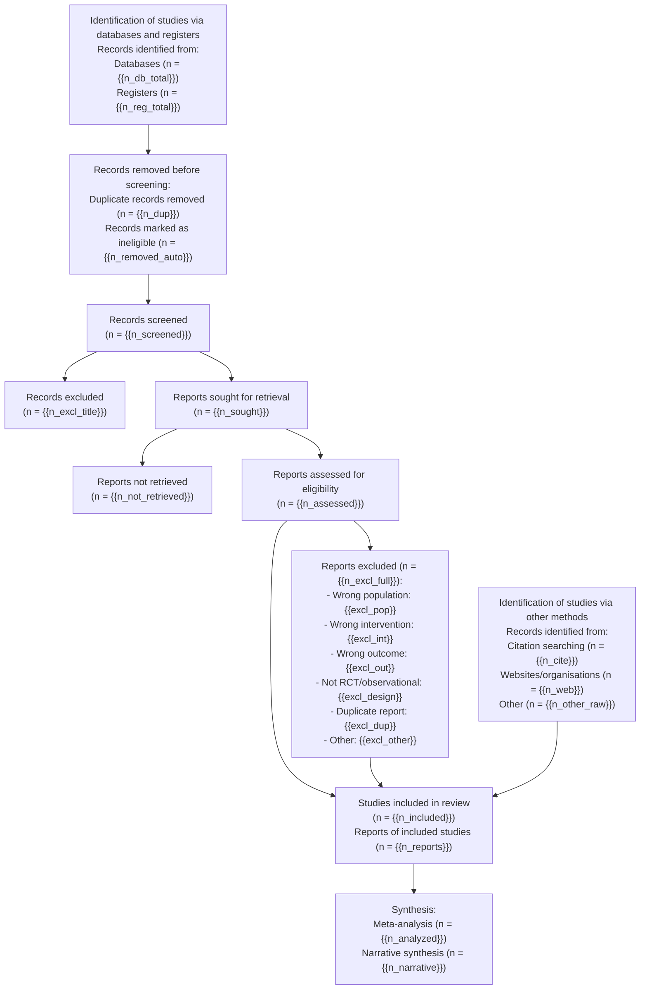

# PRISMA 2020 流程图模板

> 用法：复制本文件到 `50-manuscript/prisma_flowchart/`，把 `{{...}}` 占位符替换为
> `projects/<slug>/20-screening/prisma_counts.md` 中的实际计数。所有数字必须闭环：
> 识别 → 去重 → 筛选 → 检索 → 纳入 → 合成。

## 1. 计数（来自 prisma_counts.md）

| 环节 | 变量 | 计数 |
|---|---|---|
| 数据库识别 | `n_db_total` | `{{n_db_total}}` |
| 注册库识别 | `n_reg_total` | `{{n_reg_total}}` |
| 去重移除（重复） | `n_dup` | `{{n_dup}}` |
| 自动化/其他原因移除 | `n_removed_auto` | `{{n_removed_auto}}` |
| 题录筛选 | `n_screened` | `{{n_screened}}` |
| 题录排除 | `n_excl_title` | `{{n_excl_title}}` |
| 全文检索 | `n_sought` | `{{n_sought}}` |
| 全文未获取 | `n_not_retrieved` | `{{n_not_retrieved}}` |
| 全文评估 | `n_assessed` | `{{n_assessed}}` |
| 全文排除 | `n_excl_full` | `{{n_excl_full}}` |
| 纳入研究 | `n_included` | `{{n_included}}` |
| 纳入研究报告数 | `n_reports` | `{{n_reports}}` |
| 其他来源报告纳入 | `n_other` | `{{n_other}}` |

**闭环校验（必须全部成立）：**
```
n_db_total + n_reg_total - n_dup - n_removed_auto = n_screened
n_screened - n_excl_title = n_sought
n_sought - n_not_retrieved = n_assessed
n_assessed - n_excl_full = n_included
n_included + n_other = 纳入合成研究数
```

## 2. 流程图（Mermaid，可直接渲染为 PNG/SVG）

> 在支持 Mermaid 的编辑器（Typora/VS Code+Mermaid/在线 mermaid.live）打开即得图。
> 也可用 `npx @mermaid-js/mermaid-cli` 或 R `DiagrammeR` 导出高清 PNG/PDF。



## 3. 文本版（投稿用 alt text / 纯 Markdown 环境）

- **识别**：数据库 + 注册库共识别 `{{n_db_total}}`+`{{n_reg_total}}` 条；去重及自动化移除 `{{n_dup}}`+`{{n_removed_auto}}` 条。
- **筛选**：对 `{{n_screened}}` 条题录进行筛选，排除 `{{n_excl_title}}` 条。
- **检索**：获取 `{{n_sought}}` 篇，未获取全文 `{{n_not_retrieved}}` 篇。
- **纳入**：评估 `{{n_assessed}}` 篇，排除 `{{n_excl_full}}` 篇（原因：`{{excl_pop}}`/`{{excl_int}}`/`{{excl_out}}`/`{{excl_design}}`/`{{excl_dup}}`/`{{excl_other}}`），最终纳入 `{{n_included}}` 项研究（`{{n_reports}}` 篇报告）。
- **合成**：`{{n_analyzed}}` 项进入 meta 分析，`{{n_narrative}}` 项纳入叙述性综合。

## 4. 排除原因合计校验

```
excl_pop + excl_int + excl_out + excl_design + excl_dup + excl_other = n_excl_full
```

> 若未区分到个位，可合并为"其他原因"。**绝不允许**出现 `n_excl_full` 大于各项原因之和的情况。
